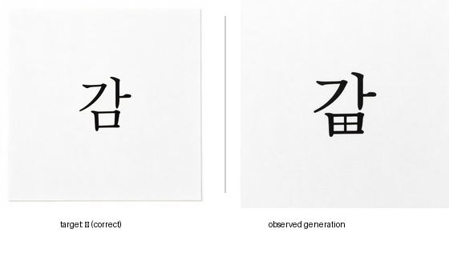
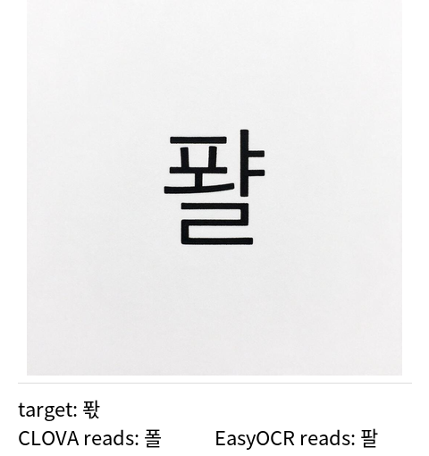
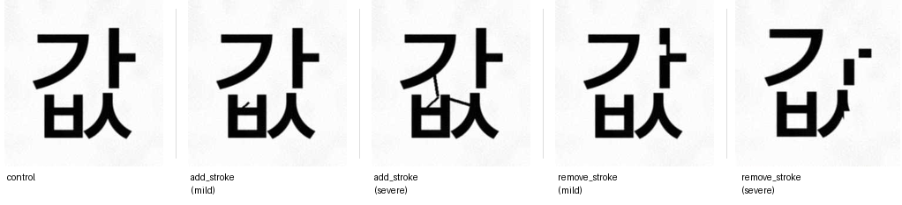

# OCR-Based Scoring Conceals Rendering Failures in Text-to-Image Evaluation: Evidence from Hangul

**A measurement-validity study**

Taewoo Lim · 2026-08 · Technical Note

---

## Abstract

Text-to-image (T2I) benchmarks for visual text rendering routinely score
generated images with an OCR engine. We show that this practice has a
structural defect: recognition-based judges are closed-set classifiers that
must return *some* character from a known inventory, and therefore cannot
report the single most informative failure mode — that the model drew a
glyph that **does not exist in the writing system at all**.

Using 300 Hangul syllable images from a commercial T2I model, exhaustively
labelled by two human annotators (binary validity: Krippendorff's α = 0.942),
we find that **21.7% of outputs are not valid Hangul syllables** — they are
Hangul-shaped glyphs that cannot be typed, e.g. a final consonant ㅁ drawn
with an internal cross. Three OCR engines with independent architectures
(Naver CLOVA, EasyOCR, PaddleOCR) each map 77–83% of these non-existent
glyphs onto a valid syllable, and in 77% of jointly-answered cases the two
engines snap to *different* characters — indicating the cause is the
closed-set formulation itself rather than a shared dictionary.

The consequences for benchmark numbers are large. Relative to human ground
truth, OCR-only scoring understates absolute accuracy by 25.6–50.0 percentage
points, and because the understatement grows with orthographic complexity,
it **exaggerates the complex-coda penalty by 2.3×–4.0×**. Effect-size
estimates also depend on engine choice, so results from papers using
different OCR engines are not comparable.

To isolate the judge property from any particular generator, we run a
controlled paired experiment using no generative model at all: clean
font renderings (control) versus the same glyphs with strokes
programmatically added or removed (treatment, invalid by construction).
EasyOCR's answer rate is statistically indistinguishable between conditions
(96.4% vs 93.0%; p = 0.234; equivalence test at ±10pp margin passes), and
its confidence distribution is likewise indistinguishable (0.458 vs 0.464,
Mann–Whitney p = 0.841). The engine cannot tell a real character from a
fabricated one, and its confidence carries no signal about the difference.

The implication is not that a more accurate OCR is needed: concealment is
decoupled from accuracy (the most accurate of the three engines still
conceals 78.5%), because the defect lies in the closed-set output
formulation rather than in recognition quality. What is needed instead is an
evaluation protocol built around the limitation — reporting "not a valid
character" as a distinct outcome, and quantifying rather than hiding the
human fraction it requires.

We release the human-labelled gold set, all code, and a verification script
that recomputes every number in this note from raw data.

---

## 1. Problem

Benchmarks that measure how well image generators render text (AnyText,
Qwen-Image's evaluation suite, and Hangul-specific efforts) share a common
pipeline: prompt the model with a target string, run OCR on the output,
compare the OCR reading to the target. The OCR engine is treated as a
transparent measuring instrument.

It is not. An OCR engine trained to recognise a script has a fixed output
inventory — for Hangul, the 11,172 precomposed syllables of the Unicode
Hangul Syllables block. Confronted with an image containing a glyph outside
that inventory, the engine has no way to say "none of the above". It returns
its nearest neighbour.

This matters because generative models fail in exactly that way. They do not
merely draw the *wrong* character; they draw characters that **do not
exist**. One annotated case: asked for '감' (gam), the model produced a glyph
whose final consonant ㅁ contained an internal cross, making it '田' — not a
Hangul jamo. The human annotator classified this as "not typeable". CLOVA
and a shape-matching baseline both read it as '감' and scored it correct.

**Figure 1** shows this pair as generated. The vendor and model identifier
are withheld pending written clarification on redistribution terms (§9);
both images were produced by the same generator under the same prompt
template, target syllable '감', with only the sampling draw differing.



*Figure 1. Left: a correctly formed output for the same target. Right: the
observed failure — an invalid glyph resembling '田' in place of the coda.
Generating model withheld pending provider clarification (§9); the
controlled reproduction of this failure type used for the causal experiment
in §5 uses only OFL font renderings (Figure 2) and does not depend on this
image.*

If the dominant failure mode is invisible to the instrument, the benchmark
measures something other than what it claims to.

---

## 2. Data

**Generator.** A commercial text-to-image model accessed via a paid API, 300
images, two prompt templates, single Hangul syllable targets drawn from an
18-cell stratified design (2 vowel classes × 3 coda classes × 3 onset
groups; see `docs/partitioning.md`). We withhold the vendor and model
identifier here pending written clarification from the provider on
redistribution and publication terms (see `docs/RELEASE.md`); this is a
disclosure-scope choice, not an attempt to obscure the finding, and no
per-vendor claim is made — §7 states explicitly that this note does not rank
or characterise any specific model.

**Human ground truth.** All 300 images were labelled target-blind. The
primary criterion, fixed after a pilot revealed that "illegible" was being
used inconsistently, is:

> **Can this glyph be typed on a standard keyboard?** — i.e. is it a member
> of the 11,172 valid precomposed syllables?

This is a binary, reproducible criterion, not a subjective legibility
judgment. Annotators transcribed the character only when they judged it
valid.

**Reliability.** Two annotators independently labelled an 87-item subset.

| Judgment | Agreement |
|---|---|
| Binary validity (valid / not) | 97.7% raw; **Krippendorff's α = 0.942** |
| Transcription, given both said valid | **23/23 = 100%** |
| 4-way subcategory (malformed / non-Hangul / multi / none) | α = 0.576 |

The binary axis is highly reliable and the transcription that follows it is
perfect. The finer subcategories are **not** reliable — the boundary between
"malformed Hangul" and "not Hangul" is a continuum, and 17 of 21
disagreements fall on exactly that boundary. We therefore report only the
binary distinction as a primary measure and treat subcategories as
exploratory.

**Label distribution (n = 300).**

| Label | n | % |
|---|---|---|
| valid syllable | 235 | 78.3% |
| malformed (Hangul-structured, invalid strokes) | 42 | 14.0% |
| non-Hangul (symbols, shapes) | 13 | 4.3% |
| multiple syllables | 10 | 3.3% |
| **not a valid syllable (total)** | **65** | **21.7%** |

---

## 3. Result 1 — Three engines conceal invalid glyphs at the same rate

For each of the 65 human-invalid images we ask: does the engine nonetheless
return a single valid Hangul syllable?

| Engine | Architecture | Concealment rate | False positives (matched target) |
|---|---|---|---|
| CLOVA General OCR | commercial, closed | 50/65 = **76.9%** | 2 |
| EasyOCR | CRNN, open source | 54/65 = **83.1%** | 3 |
| PaddleOCR (`korean_PP-OCRv5`) | PP-OCR, open source | 51/65 = **78.5%** | 3 |

The three engines share neither training data nor architecture, yet converge
on 77–83%.

**The cause is the closed-set formulation, not a shared lexicon.** Of the 44
invalid images where both CLOVA and EasyOCR returned an answer, **34 (77.3%)
returned *different* characters**. They do not agree on what the glyph is;
they only agree that it must be *something*.

Examples (target → CLOVA / EasyOCR): 퐋 → 쨰 / 팩 · 죇 → 죗 / 젖 · 쬐 → 쩍 / 짜.



*Figure 3. Target '퐋' = ㅍ + ㅘ (a two-stroke compound vowel, ㅗ+ㅏ) + ㄳ (a
two-consonant coda cluster). What was actually drawn is onset ㅍ followed by
two separate vowel strokes — one shaped like ㅗ, the other showing two tick
marks like ㅑ — a pairing that is not one of Hangul's seven legal compound
vowels (ㅘㅙㅚㅝㅞㅟㅢ); ㅗ+ㅑ does not exist as a diphthong. The coda is
also simplified, from the target's cluster ㄳ to a plain ㄹ. Because no valid
syllable contains both drawn vowel strokes, CLOVA and EasyOCR each keep only
one: CLOVA reads '폴' (ㅍ+**ㅗ**+ㄹ), matching the ㅗ-shaped stroke; EasyOCR
reads '팔' (ㅍ+**ㅏ**+ㄹ), the closest single vowel to the ㅑ-shaped stroke.
The two engines are not disagreeing over one ambiguous vowel — each discards
a different real stroke from a glyph whose vowel component has no valid
single-character reading at all.*

Note that false positives — cases where the concealed reading happens to
match the target and thus inflates the score directly — are rare (2–3 of 65).
Concealment damages measurement mainly by *erasing a failure category*, not
by awarding spurious credit.

---

## 4. Result 2 — Understatement grows with complexity, exaggerating structural effects

Exact-match accuracy against the target, unconditional (invalid glyphs count
as wrong), n = 300:

| Coda class | Human | CLOVA | EasyOCR | PaddleOCR |
|---|---|---|---|---|
| no coda | 70.0% | 44.4% | 43.3% | 61.1% |
| simple coda | 60.8% | 30.0% | 17.5% | 27.5% |
| complex coda | 55.6% | 8.9% | 5.6% | 10.0% |
| **overall** | **62.0%** | 28.0% | 21.7% | 32.3% |

Understatement (human − engine), paired bootstrap, 95% CI:

| | no coda | simple coda | complex coda |
|---|---|---|---|
| CLOVA | +25.6 [15.6, 35.6] | +30.8 [22.5, 39.2] | **+46.7 [36.7, 57.8]** |
| EasyOCR | +26.7 [16.7, 36.7] | +43.3 [34.2, 52.5] | **+50.0 [38.9, 61.1]** |
| PaddleOCR | +8.9 [1.1, 17.8] | +33.3 [25.0, 41.7] | **+45.6 [34.4, 56.7]** |

Every interval excludes zero. Critically, **the understatement is not
constant** — it grows with orthographic complexity. Because a structural
comparison is a difference of two accuracies, a complexity-correlated bias
does not cancel:

| | complex − simple coda gap | Exaggeration | Ratio |
|---|---|---|---|
| Human (truth) | **−5.3pp** | — | 1.0× |
| CLOVA | −21.1pp | −15.8pp, CI [−29.4, −1.4] **significant** | **4.0×** |
| PaddleOCR | −17.5pp | −12.2pp, CI [−25.3, +1.7] n.s. | 3.3× |
| EasyOCR | −11.9pp | −6.7pp, CI [−21.1, +7.8] n.s. | 2.3× |

All three engines overstate the complex-coda penalty; for CLOVA the
exaggeration is statistically significant at n = 300. **The exaggeration
factor differs by engine (2.3×–4.0×), so effect sizes reported by studies
using different OCR engines are not comparable.**

This is the practically important claim of this note. A paper concluding
"complex orthography degrades rendering by X%" using OCR scoring may be
reporting a number several times the true effect, with the multiplier set by
an arbitrary tooling choice.

---

## 5. Result 3 — Controlled experiment: engines cannot detect fabricated glyphs

Results 1–2 are observational: they compare judges against human labels on
one generator's output. To establish the judge property causally and
independently of any generator, we run a paired experiment with **no
generative model**.

**Design.**

| | |
|---|---|
| Control | clean font rendering of a valid syllable (n = 84) |
| Treatment | *the same syllable*, with strokes programmatically added or removed at three severities (n = 497) |
| Randomisation | syllable, perturbation site, and severity all seeded RNG |
| Controlled | font, resolution, glyph scale, ink volume — same base glyph |
| Ground truth | invalid **by construction**; a template-match post-check discards samples that accidentally reconstruct a different real syllable (7 rejected) |

Perturbations mirror failure types recorded in the human audit notes
("a stroke of the final ㅂ is missing", "unknown strokes added to ㅡ").



*Figure 2. The same syllable ('값') under all five conditions of the paired
design, generated by `synthetic_malformed.make_item()` and rendered with
identical print-like degradation (same seed) across all five panels so the
comparison isolates the perturbation, not incidental rendering noise. Only
the leftmost image is a real syllable; the other four are invalid by
construction. The severity gradient from mild to severe is visible in
stroke count and displacement.*

**Findings (EasyOCR).**

| | Control | Treatment |
|---|---|---|
| Returns a valid syllable | 96.4% | 93.0% |
| Mean confidence | 0.458 | 0.464 |

- Answer rate: difference −3.5pp, z = −1.19, **p = 0.234**. Because the
  hypothesis of interest is *absence* of discrimination, we additionally run
  a TOST equivalence test at a ±10pp margin: the 95% CI [−9.2, +2.2] lies
  entirely within the margin — **equivalence is positively established**, not
  merely "failed to reject".
- Confidence: Mann–Whitney **p = 0.841**. The confidence distribution when
  looking at a real character is statistically identical to when looking at a
  fabricated one. **Confidence carries no signal for this distinction** —
  ruling out the obvious mitigation of thresholding on confidence.

**Findings (template matching, closed-set shape baseline).** Control accuracy
96.4%; on perturbed glyphs it snaps back to the unperturbed original 94.0% of
the time. A purely geometric matcher with no language model shows the same
behaviour, confirming the mechanism is closed-set forced choice rather than
linguistic priors.

**Sensitivity.** The engines are not wholly insensitive: for stroke removal,
snap rate falls from 98.8% (mild) to 81.0% (severe), p = 0.0002. Detection
is a matter of degree. But the near-miss regime — one stroke wrong — is both
where detection fails and where real generator failures live.

A third engine (PaddleOCR) was run on a reduced replication (n = 126) and
reproduces the direction (control 88.9% vs treatment 84.3%, p = 0.611;
confidence 0.669 vs 0.591, p = 0.351) but with a control group too small
(n = 18) to pass the strict equivalence test. We report EasyOCR (n = 84
control) as the confirmatory result and PaddleOCR as directional replication.

---

## 6. A partial mitigation, and its limits

We tested whether a confidence gate can salvage automatic scoring: accept the
OCR reading when confidence ≥ 0.80, route everything else to a human. Two
refinements were required, both discovered empirically:

- The gate is **self-correcting on the coda axis** — CLOVA loses confidence
  precisely where it is unreliable, so hard cases route to humans and bias
  shrinks rather than grows.
- It **fails for tensed onsets** (ㄲㄸㅃㅆㅉ), where CLOVA is *confidently*
  wrong: disagreement with humans in the auto-accepted region is 47.4%,
  versus 4.5% for plain onsets. Excluding tensed onsets from auto-acceptance
  brings bias spread on all three cell axes below 2.5pp.

Resulting protocol: **50% of images still require human judgment.** We report
this not as a solution but as a measured lower bound on automation for this
task. Crucially, the protocol still cannot detect invalid glyphs: of 128
auto-accepted images, 16 (12.5%) are human-invalid, inflating the reported
valid-syllable rate from a true 78.3% to 83.7%. **The concealment effect
reproduces inside our own result table**, which is why every automatically
scored figure must be published with its measured bias.

---

## 7. What this note does and does not claim

**Claims.**

1. Recognition-based judges conceal non-existent glyphs at 77–83%, replicated
   across three independent architectures (§3).
2. OCR-only scoring understates accuracy by 25.6–50.0pp, with the
   understatement growing with complexity, exaggerating structural effects
   2.3×–4.0× (§4).
3. Engines cannot distinguish fabricated glyphs from real ones, and their
   confidence carries no signal for the distinction — established causally in
   a controlled, generator-free paired experiment (§5).
4. Human binary validity judgment is reliable (α = 0.942) and is also the
   *cheapest* human judgment, since it requires no transcription.

**Explicitly not claimed.**

- **Not a model benchmark.** One generator, 300 images. We make no claim
  about this or any model's ranking. The generator is an instance, not the
  subject.
- **No causal claim about orthographic structure.** The finding that complex
  codas are harder is observational and confounded with character frequency
  and stroke count. We could not separate these, and a prior version of this
  project mistakenly attributed an OCR scale artefact to coda complexity
  before the confound was found.
- **Per-cell (18-cell) values are not reported.** At ~12 images per cell,
  confidence intervals are uninformative. Only the three marginal axes are
  reported.
- **The cross-script generalisation in §8.2 is a prediction, not a result.**
  We tested Hangul only. No Chinese, Japanese, Devanagari or Arabic data were
  collected; §8.2 states a mechanism-based expectation and supplies a method
  to test it.
- **The decoupling claim in §8.1 rests on three engines.** We claim only that
  concealment does not track accuracy, not that they are inversely related.
- **The tensed-onset exclusion rule is in-sample.** Derived from n = 63 and
  evaluated on the same data; it needs out-of-sample confirmation.
- **One primary annotator is the author.** The second annotator is
  independent; agreement statistics are computed between them. This is a
  limitation, disclosed.

---

## 8. Implications

### 8.1 The fix is not "a more accurate OCR"

The natural reading of these results is that we need a better OCR engine.
The data argue otherwise: **concealment is decoupled from accuracy.**

| Engine | Accuracy (valid glyphs) | Concealment (invalid glyphs) |
|---|---|---|
| PaddleOCR | **32.3%** (best) | 78.5% |
| CLOVA | 28.0% | **76.9%** (lowest) |
| EasyOCR | **21.7%** (worst) | **83.1%** (highest) |

Accuracy varies by a factor of 1.49 across the three engines; concealment
varies by only 1.08. The *most* accurate engine still conceals 78.5% of
non-existent glyphs. (With n = 3 engines we do not claim a monotonic
relationship — the rank orders are not simply inverted — only that
concealment does not track accuracy.)

This is what one would expect from the mechanism. Concealment is not a
recognition error to be trained away; it is a consequence of the **output
formulation**. A classifier whose label space is the 11,172 valid syllables
has no symbol for "none of these", so the question "is this a character at
all?" is not merely answered badly — it is not asked. §5 confirms this on the
judge's own confidence signal: the confidence distribution on fabricated
glyphs is statistically identical to that on real ones (p = 0.841), so no
threshold on any post-hoc confidence score can recover the distinction.

Making the label space open — open-set recognition, or a calibrated reject
option — is a live and unsolved problem in machine learning generally, not a
matter of more training data for Korean. **Treating "get a better OCR" as the
action item defers the problem indefinitely.** The tractable action is to
design the *evaluation protocol* around the limitation, which is what §6 and
§8.3 describe.

### 8.2 Beyond Hangul: a prediction for other compositional scripts

Hangul is a convenient test case because its composition rule is explicit and
its valid inventory is exactly enumerable (19 × 21 × 28 = 11,172), which is
what makes "this glyph is not in the inventory" a decidable, reproducible
label. But nothing in the mechanism is Hangul-specific.

We therefore **predict, without having tested it**, that the same concealment
occurs for any writing system where characters are assembled from reusable
sub-parts and the recogniser's label space is the set of assembled
characters — Chinese radical composition, Japanese kanji, Devanagari and
other Brahmic conjuncts, Arabic ligature forms. A generator that draws a
plausible-but-nonexistent composition in those scripts should be silently
mapped onto its nearest real character, for exactly the reason it is here.

This matters because the major visual-text-rendering benchmarks (AnyText,
the Qwen-Image evaluation suite, and their successors) score Chinese with
OCR pipelines of the same architecture family as the ones tested here.

The prediction is cheap to test, and we release the means to do it: the
`synthetic_malformed` procedure (§5) requires only a font and a list of valid
characters, uses no generative model, and yields ground truth by
construction. Porting it to another script is a matter of substituting the
character inventory and the perturbation primitives.

### 8.3 Recommendations

For anyone building or reading a visual-text-rendering benchmark:

1. **Validate the judge before scoring the model.** Compare the judge to
   human labels on a sample from the same distribution. This project made
   three separate wrong attributions — including attributing an OCR
   font-scale artefact to model weakness — before the pipeline was checked.
2. **Test whether the judge can abstain**, not just whether it is accurate.
   Accuracy on valid characters says nothing about behaviour on invalid ones,
   and the latter is where generators fail. §8.1: picking the most accurate
   engine does not help.
3. **Report "not a valid character" as a first-class outcome**, separate from
   "wrong character". They are different failures with different causes, and
   the distinction costs nothing to add to a results table.
4. **Do not compare effect sizes across studies using different OCR
   engines.** The exaggeration factor is engine-dependent (2.3×–4.0× here).
5. **If full automation is not achievable, say so and quantify the human
   fraction** rather than reporting an automated number that hides it. Our
   measured floor is 50%; we report it as a result, not a shortfall.

---

## 9. Reproducibility

Code: [github.com/Nasser-Lim/jamo-bench](https://github.com/Nasser-Lim/jamo-bench).
Data: [huggingface.co/datasets/Nasser4963/jamo-gold](https://huggingface.co/datasets/Nasser4963/jamo-gold).

```bash
git clone https://github.com/Nasser-Lim/jamo-bench && cd jamo-bench
pip install -e ".[dev]"
python scripts/verify_claims.py
```

Every number in this note is recomputed from `release/` (mirrored to the
HuggingFace repo above) by this script. If its output disagrees with this
document, the document is wrong. The script exists because a data-loading
bug in an earlier revision silently dropped 44 human-labelled images and
inverted two of this project's conclusions; numbers are therefore never
transcribed by hand.

Released artifacts, code layout, and licensing are described in
[`RELEASE.md`](https://github.com/Nasser-Lim/jamo-bench/blob/main/docs/RELEASE.md).

**Environment note.** PaddleOCR 3.x requires `enable_mkldnn=False` on Windows
CPU (the default crashes with a PIR/oneDNN error). OpenCV cannot read paths
containing Hangul on Windows, so all image loading goes through PIL.

## 10. Authorship and disclosed tool use

The study design, data collection, annotation, statistical analysis, and
every conclusion in this note are the author's own work and are
independently checkable against raw data by running `verify_claims.py`
(§9) — nothing here is asserted without a script that recomputes it from
source. Prose drafting, editing, and the Korean translation were produced
with the assistance of a general-purpose AI writing tool, under the
author's direction; the author reviewed and takes full responsibility for
every claim and figure. No AI system is an author of this work, and no
text or figure was generated to imply a result not present in the
underlying data.

Two figures (Fig. 1, Fig. 3) contain real outputs from the commercial
text-to-image model under study. This is experimental *data*, not
editorial content produced for this note — the images are the subject
being measured, not an illustration generated to accompany the argument —
and this is disclosed in each caption (§1, §3).

---

## Appendix A — Failure composition (human ground truth, n = 300)

| Coda class | Correct | Valid but wrong | Not a valid character |
|---|---|---|---|
| no coda (n=90) | 70.0% | 13.3% | 16.7% |
| simple coda (n=120) | 60.8% | 15.0% | 24.2% |
| complex coda (n=90) | 55.6% | 21.1% | 23.3% |

Valid-syllable production rate by coda class, with bootstrap CI:

| Coda class | Rate | 95% CI |
|---|---|---|
| no coda | 83.3% | [75.6, 90.0] |
| simple coda | 75.8% | [67.5, 83.3] |
| complex coda | 76.7% | [67.8, 85.6] |

complex − no coda: −6.7pp, CI [−17.8, +4.4] — **not significant**, and not
monotonic. We do not claim that complex codas produce more invalid glyphs.

## Appendix B — Jamo-position error rates (human ground truth)

| Position | Conditional (valid only, n=235) | Unconditional (invalid = all three wrong, n=300) |
|---|---|---|
| onset | 1.7% [0.4, 3.4] | 23.0% [18.3, 28.0] |
| nucleus | 9.8% [6.0, 13.6] | 29.3% [24.3, 34.3] |
| coda | 17.0% [12.3, 21.7] | 35.0% [29.7, 40.3] |

The onset < nucleus < coda ordering holds under both denominators. Note that
jamo decomposition is only defined for valid syllables; for invalid glyphs
any decomposition is an artefact of whatever the judge snapped to, which is
why both denominators are reported.
